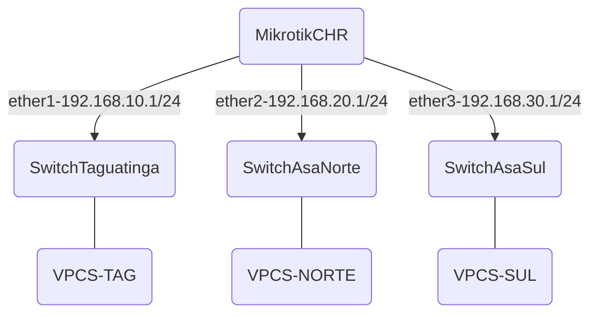

# DHCP (Dynamic Host Configuration Protocol)

## Visão Geral

O **DHCP** (Dynamic Host Configuration Protocol) é um protocolo que permite a configuração automática de dispositivos em uma rede IP. Ele atribui dinamicamente endereços IP e outras configurações essenciais, como máscara de sub-rede, gateway padrão e servidores DNS, para os dispositivos da rede. Esse processo automatiza a configuração, reduzindo a necessidade de intervenção manual.

## Como Funciona o processo: DORA

1. **Discover**: O dispositivo envia uma solicitação DHCP para descobrir servidores disponíveis na rede.
2. **Offer**: O servidor DHCP responde oferecendo um endereço IP e configurações de rede.
3. **Request**: O dispositivo solicita formalmente o endereço IP oferecido.
4. **Acknowledge**: O servidor confirma e aloca o endereço IP para o dispositivo por um tempo determinado, conhecido como **tempo de lease**.

## Importância do DHCP

- **Automação e Eficiência**: DHCP simplifica o ingresso e remoção de dispositivos na rede, automatizando a configuração e viabilizando a obtenção automática de IP e outros recursos necessários, tais como as Options para dispositivos VoIP, por exemplo, reduzindo o tempo e o trabalho administrativo.
- **Redução de Erros**: Automatizar a atribuição de endereços IP minimiza o risco de erros de configuração, como endereços IP duplicados ou configurações incorretas, que podem causar problemas de conectividade.
- **Escalabilidade**: O DHCP é essencial para redes de médio e grande porte, onde configurar manualmente cada dispositivo seria impraticável.
- **Facilidade de Gerenciamento**: Com o DHCP, os administradores de rede podem controlar a faixa de IPs e outras configurações de rede de forma centralizada e flexível.

## Atividade Prática: Configuração de DHCP para Rede Governamental

Imagine um cenário que envolve a conexão de três unidades regionais hipotéticas do **Governo do Distrito Federal (GDF)** espalhadas em diferentes regiões. O objetivo é garantir a configuração dinâmica de endereçamento das estações de trabalho de cada unidade: **Taguatinga**, **Asa Norte**, e **Asa Sul**, usando o DHCP:



### Unidades e Sub-redes Simuladas

Cada unidade é representada por uma sub-rede diferente.
O roteador central fará o roteamento entre essas sub-redes, conectando as diferentes regiões.

- **Unidade Taguatinga**: Abrange os serviços administrativos e de atendimento ao público na região de Taguatinga.
- Sub-rede `192.168.10.0/24`
- IPs na faixa de `192.168.10.1` a `192.168.10.254`.

**Unidade Asa Norte**: Abrange os serviços de planejamento e coordenação de projetos no DF.

- Sub-rede `192.168.20.0/24`
- IPs na faixa de `192.168.20.1` a `192.168.20.254`.

**Unidade Asa Sul**: Foca nos serviços de suporte técnico e infraestrutura de TI.

- Sub-rede `192.168.30.0/24`
- IPs na faixa de `192.168.30.1` a `192.168.30.254`.

### Adicionando o roteador à sua biblioteca de dispositivos no GNS3

- Acesse o GNS3 em seu navegador em `http://localhost:3080`. 

- Para instalar o roteador no GNS3, crie um novo projeto e clique em `New Template`. Em `Install appliance from server`, procure por **Mikrotik CHR** e clique em `Install`.

- Verifique qual versão está disponível no simulador (ex.: `7.11.2` ou `7.14.3`). Dependendo da versão disponível, você precisará fornecer a imagem virtual correta do equipamento, que pode ser baixada neste [link](https://drive.google.com/drive/folders/1d7FwTLtnRSnjJ5k-YRZlORNlY3c1ygQZ?usp=sharing). Escolha o arquivo correspondente à versão desejada: `chr-7.11.2.img.zip` ou `chr-7.14.3.img.zip`. Alternativamente vc pode rodar o comando `docker compose pull` a partir da raiz do repositório (ex: `/opt/ceub-teleco`) e atualizar sua imagem do ambiente, podendo usar a versão mais atualizada do router. 

- Após baixar, descompacte o arquivo na pasta desejada usando a Interface Gráfica do seu Sistema Operacional (Windows, macOS, Linux) ou via Linha de Comando, por exemplo:
  
  ```bash
  unzip chr-7.11.2.img.zip
  ```

- Para efetuar seu primeiro acesso, ligue o Router no botão `play` do GNS3. Você será convidado a inserir usuário e senha (`admin` com senha em branco, conforme indicado abaixo). Depois recuse a leitura do regulamento com `n`, defina e confirme uma nova senha, que deverá ser utilizada nos próximos acessos. 

- **Usuário**: admin
- **Senha**: 

- Pronto, agora a biblioteca do simulador GNS3 conta com um equipamento virtual configurável, com suporte a protocolos como RIP, OSPF, BGP e capacidade para simular topologias com redes Ethernet e MPLS, tanto intra-AS quanto inter-AS.

Para configurar o DHCP nesse mesmo cenário, você pode ajustar o roteador MikroTik CHR para fornecer endereços IP automaticamente para cada sub-rede. 

### Configuração do DHCP Server para cada Sub-rede
Siga os passos abaixo para configurar o MikroTik CHR como servidor DHCP para cada sub-rede.

**Passo 1**: Configuração dos Endereços IP no MikroTik CHR

Certifique-se de que as interfaces estão configuradas conforme o planejado. Vamos atribuir IPs para as interfaces de cada sub-rede:

```bash
# Rede de Taguatinga
/ip address add address=192.168.10.1/24 interface=ether1 comment="GW Taguatinga"

# Rede da Asa Norte
/ip address add address=192.168.20.1/24 interface=ether2 comment="GW Asa Norte"

# Rede da Asa Sul
/ip address add address=192.168.30.1/24 interface=ether3 comment="GW Asa Sul"
```

**Passo 2**: Configuração dos Pools de DHCP

Crie pools de endereços IP que o DHCP pode distribuir para cada sub-rede:

```bash
# Pool DHCP para Taguatinga
/ip pool add name=dhcp_pool_taguatinga ranges=192.168.10.100-192.168.10.200

# Pool DHCP para Asa Norte
/ip pool add name=dhcp_pool_asa_norte ranges=192.168.20.100-192.168.20.200

# Pool DHCP para Asa Sul
/ip pool add name=dhcp_pool_asa_sul ranges=192.168.30.100-192.168.30.200
```

**Passo 3**: Configuração do DHCP Server em Cada Interface

Agora, configure o servidor DHCP para cada interface do roteador, atribuindo o pool criado anteriormente:

```bash
# Servidor DHCP para a interface de Taguatinga
/ip dhcp-server add name=dhcp_server_taguatinga interface=ether1 address-pool=dhcp_pool_taguatinga lease-time=1h

# Servidor DHCP para a interface de Asa Norte
/ip dhcp-server add name=dhcp_server_asa_norte interface=ether2 address-pool=dhcp_pool_asa_norte lease-time=1h

# Servidor DHCP para a interface de Asa Sul
/ip dhcp-server add name=dhcp_server_asa_sul interface=ether3 address-pool=dhcp_pool_asa_sul lease-time=1h
```

**Passo 4**: Configuração das Redes do DHCP

Defina as configurações de rede para cada servidor DHCP, especificando o gateway e a máscara de sub-rede:

```bash
# Configurações de rede para Taguatinga
/ip dhcp-server network add address=192.168.10.0/24 gateway=192.168.10.1

# Configurações de rede para Asa Norte
/ip dhcp-server network add address=192.168.20.0/24 gateway=192.168.20.1

# Configurações de rede para Asa Sul
/ip dhcp-server network add address=192.168.30.0/24 gateway=192.168.30.1
```

### Topologia


### Testes com os VPCS
Agora que o roteador está configurado como servidor DHCP para cada sub-rede, os VPCS devem solicitar e receber automaticamente um endereço IP ao se conectarem aos switches. Execute o comando dhcp em cada VPCS para obter um IP do servidor DHCP:

```bash
# Em cada VPCS
ip dhcp
```
Os VPCS devem receber IPs na faixa especificada em cada pool DHCP configurado para Taguatinga, Asa Norte e Asa Sul.

### 3. Verificações no MikroTik

Para verificar os leases DHCP ativos no MikroTik:

```bash
/ip dhcp-server lease print
```

Para conferir a conectividade, você pode testar com ping entre dispositivos das diferentes sub-redes. Para visualizar o processo DHCP (Discover, Offer, Request e Acknowledge) no MikroTik CHR ao configurar DHCP em sub-redes, você pode usar o Packet Sniffer do RouterOS para capturar pacotes de DHCP e acompanhar essas mensagens no próprio roteador.

### Passos para Capturar Mensagens DHCP

- Acesse o MikroTik CHR via terminal no GNS3.
- Inicie a captura de pacotes na interface configurada para a sub-rede onde deseja monitorar o DHCP. - Supondo que queira monitorar a interface ether1 (Taguatinga):

```bash
/tool sniffer set interface=ether1
/tool sniffer start
````

Filtrar para Pacotes DHCP:

```bash
# Especifique que deseja capturar apenas pacotes UDP na porta 67 e 68, que são as portas usadas pelo DHCP:

/tool sniffer set filter-ip-protocol=udp
/tool sniffer set filter-port=67,68
```
<!--

Salve a Captura em Arquivo .pcap: Configure o sniffer para salvar a captura em um arquivo que você poderá abrir posteriormente no Wireshark para análise detalhada:

bash
/tool sniffer set file-name=dhcp_capture.pcap

Realize um Pedido DHCP:

No VPCS conectado à sub-rede, execute o comando ip dhcp para solicitar um IP. Isso gera as mensagens DHCP Discover e, em seguida, o Offer, Request e Acknowledge.

Parar a Captura:

Após o teste, pare a captura:
bash
/tool sniffer stop

Baixar e Analisar o Arquivo .pcap:

Baixe o arquivo dhcp_capture.pcap do MikroTik para o seu computador e abra-o com o Wireshark. Nele, você poderá ver o fluxo DHCP completo, incluindo as mensagens Discover, Offer, Request e Acknowledge.
Visualização das Mensagens DHCP no Wireshark

Ao abrir o arquivo no Wireshark, você poderá observar o fluxo DHCP completo:

DHCP Discover: Quando o cliente solicita um IP.
DHCP Offer: Resposta do servidor com uma oferta de IP.
DHCP Request: Cliente confirma que deseja o IP oferecido.
DHCP Acknowledge: Servidor confirma a atribuição do IP.

Isso deve lhe permitir acompanhar o processo DHCP no GNS3 usando o MikroTik CHR.
-->

## Checklist de Evidências

Para enviar no **Sala On-Line**, providencie um arquivo PDF contendo, no mínimo: 

| Evidência            | O que deve mostrar                                  |
|----------------------|------------------------------------------------------|
| Print 1 – Topologia  | Router + 3 switches + 3 VPCS + links                 |
| Print 2 – Pings      | PC da Asa Norte alcançando Taguatinga, Asa Sul e gateway |
| Print 3 – Leases     | 6 clientes DHCP registrados no MikroTik             |

## 1. Topologia no GNS3
Print obrigatório:
- Mostrar a topologia lógica.
- Elementos visíveis:
  - Router MikrotikCHR
  - SwitchTaguatinga
  - SwitchAsaNorte
  - SwitchAsaSul
  - 2 VPCs em Taguatinga
  - 2 VPCs na Asa Norte
  - 2 VPCs na Asa Sul
- Todos os dispositivos, links e interfaces `eth` devem aparecer claramente.

## 2. Testes de Conectividade
Pela topologia, use o telnet no terminal para se conectar ao dispositivo correspondente:

`telnet localhost 2001`

Comandos a executar a partir de um VPC da Asa Norte:

```bash
ip dhcp
show ip
ping 192.168.10.X
ping 192.168.30.101
ping 192.168.20.1
```

Print obrigatório:
- Um único print contendo os 3 pings executados em sequência.
- O print deve mostrar claramente que o VPCS da Asa Norte alcança:
  - Um host da rede 192.168.10.0/24 Taguatinga
  - Um host da rede 192.168.30.0/24 Asa Sul

## 3. Leases DHCP no MikroTik
Comando obrigatório:

```bash
/ip dhcp-server lease print
```

Print obrigatório:
- Devem aparecer 6 leases (6 VPCs ligados).
- O print precisa mostrar:
  - IP
  - MAC
  - Status (bound)
  - Interface de origem


## Conclusão

O DHCP é um componente essencial em redes modernas, automatizando a configuração de dispositivos e garantindo uma conexão de rede consistente e eficiente. Sua implementação melhora a gestão de redes, reduz problemas operacionais e é fundamental em ambientes com alta rotatividade de dispositivos conectados.
